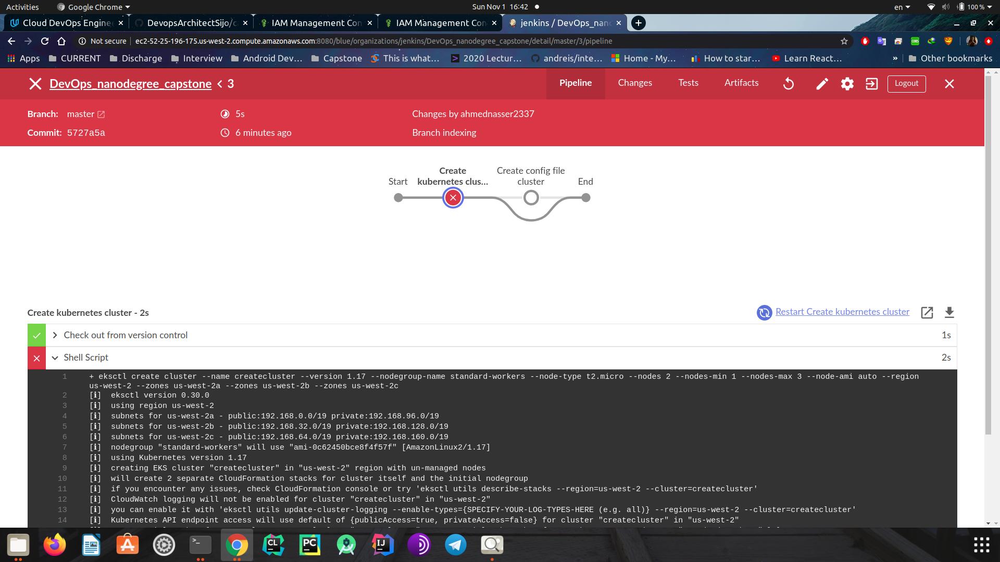
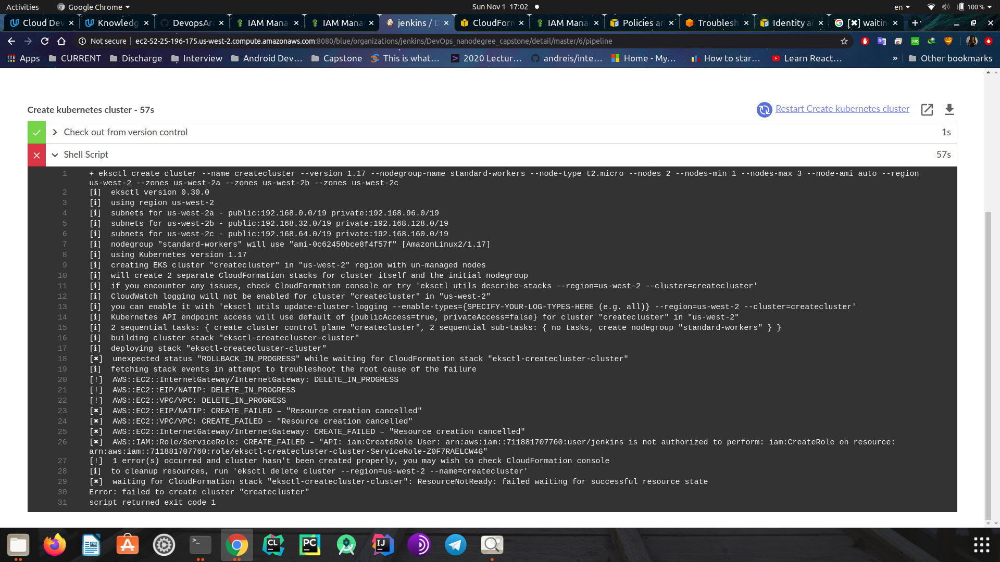
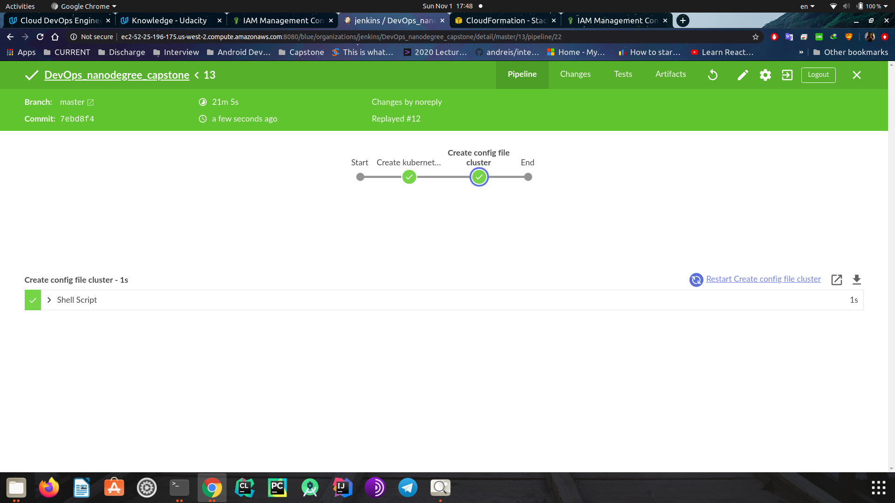
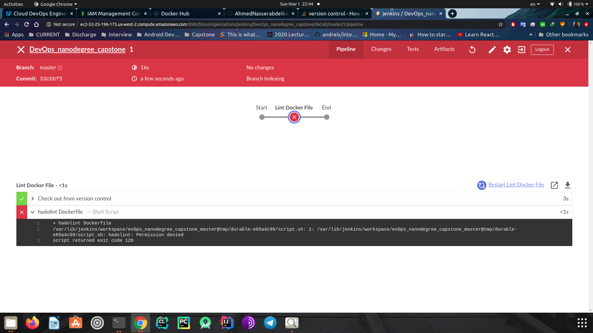
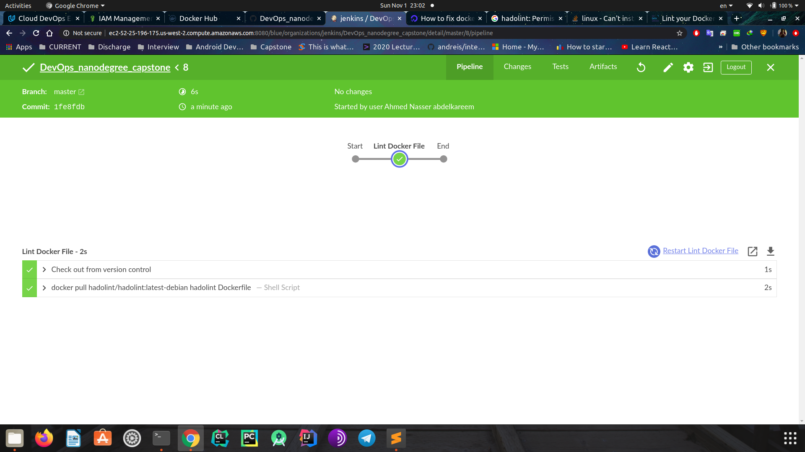
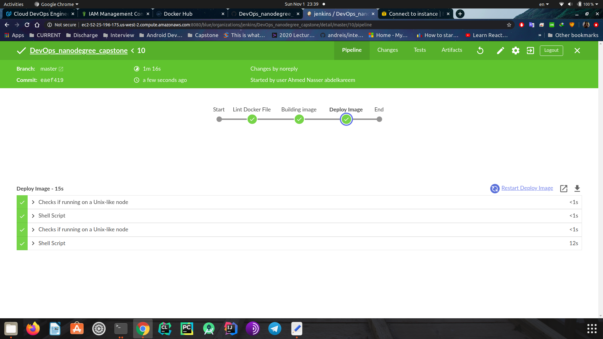
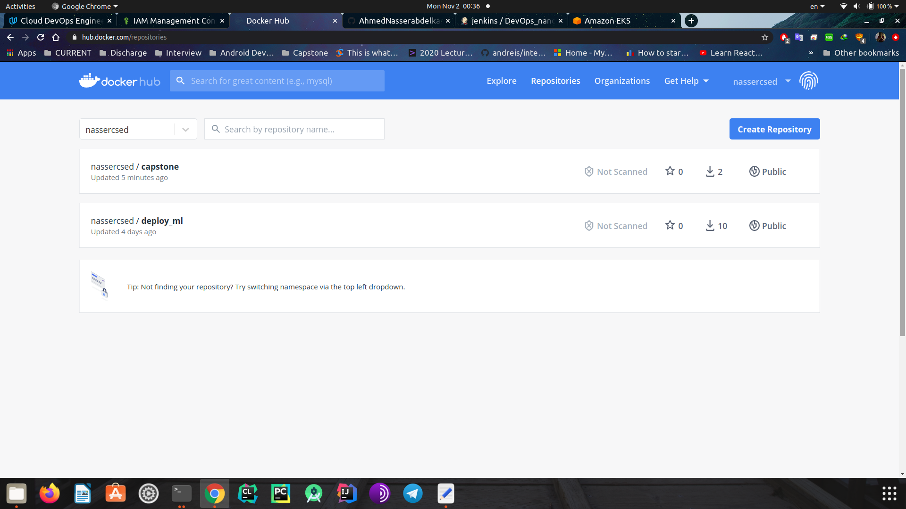

## DevOps_nanodegree_capstone

<hr>

## Project Overview

Capstone project for Udacity's "Cloud DevOps Engineer" Nanodegree Program.

<hr>

## Objectives

- Working in AWS
- Using Jenkins to implement Continuous Integration and Continuous Deployment
- Building pipelines
- Working with CloudFormation to deploy clusters
- Building Kubernetes clusters
- Building Docker containers in pipelines

<hr>

## Project Steps

1. [Development](#development)
2. [Create eks cluster](#EKS)
3. [Create image && docker hub](#Docker)
4. [Deploy to Kubernetes Cluster](#deploy-kubernetes-cluster)
5. [CI/CD Pipeline](#ci/cd-pipeline)

<hr>

### Development

 - Simple flask "Hello World" application.

<hr>

### EKS

 - First, Trying to create kubernetes cluster with this command:

    ```
        $ eksctl create cluster \
				--name capstone \
				--version 1.17 \
				--nodegroup-name standard-workers \
				--node-type t2.micro \
				--nodes 2 \
				--nodes-min 1 \
				--nodes-max 3 \
				--node-ami auto \
				--region us-west-2 \
				--zones us-west-2a \
				--zones us-west-2b \
				--zones us-west-2c \
    ```

 - Configure it using this command:


    ```
        $ aws eks --region us-west-2 update-kubeconfig --name capstone
    ```





<hr>

### Docker

 - Try to lint Dockerfile




 - Building docker image 



 - Upload it to Dockerhub




<hr>

### eploy-kubernetes-cluster


<hr>

### ci/cd-pipeline


<hr>